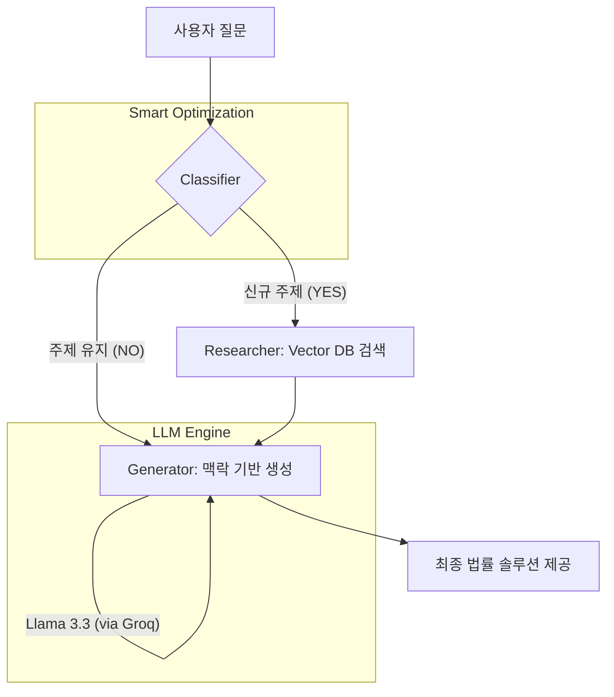

# ⚖️ Law-Action-Assistant: 지능형 복합 법률 AI 에이전트

> **"법은 복잡하지만, 당신의 대처는 명확해야 합니다."**
> 대한민국 22만 건의 전수 법령 데이터를 기반으로, **LangGraph**를 통해 사용자의 상황을 분석하고 민사·형사 복합 솔루션을 제공하는 차세대 법률 지원 에이전트입니다.

---

## 🚀 Project Overview
단순히 법조문을 나열하는 기존 RAG의 한계를 넘어, 본 프로젝트는 **Multi-Agent Workflow**를 통해 사용자의 질문을 스스로 분류하고 최적의 법령을 탐색합니다. 특히 **Groq LPU 가속**을 도입하여 응답 속도를 혁신적으로 개선했으며, **스마트 라우팅**을 통해 불필요한 검색 비용을 절감했습니다.

## 📊 Dataset & Knowledge Base
대한민국 법령정보센터로부터 직접 수집하고 정제한 고도화된 데이터셋을 기반으로 동작합니다.
- **Total Laws:** 5,567건 (대한민국 현행법령 전수)
- **Total Articles:** 약 220,000개 이상의 조문 (조 > 항 > 호 > 목 계층 구조 유지)
- **Vector DB:** ChromaDB (Persistent Local Storage) 활용
- 🔗 **[Kaggle Dataset Link](https://www.kaggle.com/datasets/ltg2757/south-korea-current-statutes-dataset-json)**

## 🧠 Advanced Agentic Workflow (LangGraph)
본 프로젝트의 핵심은 **LangGraph**를 이용한 지능형 추론 엔진입니다. 질문이 들어오면 AI는 고정된 답변을 내놓는 대신 아래와 같은 유동적인 사고 과정을 거칩니다.

### 🖼️ System Architecture


1. **`Classifier` (의도 및 맥락 분석)**: 질문이 이전 대화의 연장선인지 판단하여 **불필요한 중복 검색을 차단**합니다.
2. **`Researcher` (정밀 검색)**: 분석된 카테고리를 바탕으로 22만 건의 조문 중 최적의 법령 5개 이상을 교차 검색합니다.
3. **`Generator` (솔루션 생성)**: **Groq 기반 Llama 3.3 70B** 모델을 활용해 `상황 분석 - 법적 근거 - 대응 방법`의 3단계 계획을 초고속으로 생성합니다.

## ✨ Key Features
- **⚡ 초고속 추론**: Groq API를 연동하여 기존 대비 **약 10배 빠른 응답 속도** 구현.
- **🧠 스마트 라우팅**: 대화 흐름을 인지하여 불필요한 Vector DB 호출을 방지하고 비용 최적화.
- **🛡️ 복합 법률 진단**: 보이스피싱, 교통사고 등 민·형사가 결합된 복잡한 시나리오 통합 분석.
- **📊 실시간 트레이싱**: LangSmith를 연동하여 에이전트의 모든 사고 과정을 정밀 모니터링.

## 🛠 Tech Stack

| Category | Tools & Technologies |
| :--- | :--- |
| **Language** | Python 3.13 |
| **LLM Inference** | **Groq Cloud** (LPU Acceleration) |
| **Main Model** | **Llama-3.3-70b-versatile** |
| **Agent Framework** | **LangGraph**, LangChain |
| **Vector DB** | ChromaDB (Persistent Local Storage) |
| **Embedding** | `jhgan/ko-sroberta-multitask` |
| **Monitoring** | **LangSmith** (Tracing & Evaluation) |
| **UI Framework** | Streamlit |

---

## 📈 Data Engineering (Completed)
- [x] **고성능 배치 수집 엔진**: 국가법령정보센터 API 기반 22만 개 조문 전수 수집.
- [x] **조문 단위 Hierarchical Parsing**: `조 > 항 > 호 > 목` 위계질서를 완벽 보존한 텍스트 구조화.
- [x] **Multi-Label 분류 로직**: 복합적인 법률 갈등 상황을 스스로 인지하는 라우팅 엔진 구축.

### 🔍 데이터 구조화 예시
```text
<근로기준법>
제17조 (근로조건의 명시)
  [항] ① 사용자는 근로계약을 체결할 때에 근로자에게 다음 각 호의 사항을 명시하여야 한다.
    └─[호] 1. 임금
    └─[호] 3. 소정근로시간
```

---

## ⚠️ Disclaimer
본 서비스는 법률 전문가의 자문을 대체할 수 없으며, 제공되는 답변은 대한민국 법령 데이터를 기반으로 한 참고용 정보입니다. 실제 법적 대응 시에는 반드시 변호사 등 전문가와 상의하시기 바랍니다.

---

