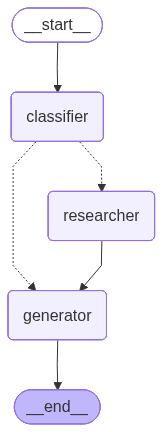

# ⚖️ Law-Action-Assistant: 지능형 복합 법률 AI 에이전트

> **"법은 복잡하지만, 당신의 대처는 명확해야 합니다."**
> 대한민국 22만 건의 전수 법령 데이터를 기반으로, **LangGraph**를 통해 사용자의 상황을 분석하고 민사·형사 복합 솔루션을 제공하는 차세대 법률 지원 에이전트입니다.

---

## 🚀 Project Overview
단순히 법조문을 나열하는 기존 RAG의 한계를 넘어, 본 프로젝트는 **Multi-Agent Workflow**를 통해 사용자의 질문을 스스로 분류하고 최적의 법령을 탐색합니다. 특히 보이스피싱, 교통사고와 같이 민·형사가 결합된 복합적인 시나리오에서 강력한 통합 액션 플랜을 제시합니다.

## 📊 Dataset & Knowledge Base
대한민국 법령정보센터로부터 직접 수집하고 정제한 고도화된 데이터셋을 기반으로 동작합니다.
- **Total Laws:** 5,567건 (대한민국 현행법령 전수)
- **Total Articles:** 약 220,000개 이상의 조문 (조 > 항 > 호 > 목 계층 구조 유지)
- **Vector DB:** ChromaDB (Persistent Local Storage) 활용
- 🔗 **[Kaggle Dataset Link](https://www.kaggle.com/datasets/ltg2757/south-korea-current-statutes-dataset-json)**

## 🧠 Advanced Agentic Workflow (LangGraph)
본 프로젝트의 핵심은 **LangGraph**를 이용한 지능형 추론 엔진입니다. 질문이 들어오면 AI는 고정된 답변을 내놓는 대신 아래와 같은 유동적인 사고 과정을 거칩니다.


---

### 🖼️ System Architecture
현재 서비스의 핵심 로직은 아래와 같은 LangGraph 구조로 설계되었습니다.

<p align="center">
  
  <br>
  <em>[지능형 에이전트 워크플로우: 분류 - 검색 - 생성]</em>
</p>

---

1. **`Classifier` (의도 분석)**: 사용자의 질문이 '법률' 관련인지 '일상' 대화인지 판단하고, 관련 법률 분야(민사, 형사, 가사, 노동 등)를 멀티 레이블로 추출합니다.
2. **`Researcher` (정밀 검색)**: 추출된 분야 키워드와 질문 내용을 결합하여 22만 건의 조문 중 가장 연관성이 높은 5개 이상의 법령을 교차 검색합니다.
3. **`Generator` (솔루션 생성)**: 검색된 법적 근거를 바탕으로 `상황 분석 - 법적 근거 - 대응 방법`의 3단계 실행 계획을 생성합니다.

## ✨ Key Features
- **🛡️ 복합 법률 진단**: "돈을 안 갚고 잠적했다"는 질문에 대해 사기죄(형사)와 대여금 반환(민사)을 동시에 분석합니다.
- **🔍 고정밀 법령 매칭**: 단순 검색이 아닌, AI가 판단한 카테고리를 검색 쿼리에 포함하여 검색 정확도를 극대화했습니다.
- **🚀 실시간 프로세스 시각화**: Streamlit UI에서 AI가 현재 어떤 단계(분류/검색/생성)를 수행 중인지 실시간 상태를 제공합니다.
- **📊 LangSmith 연동**: 모든 에이전트의 사고 과정과 토큰 사용량, 응답 속도를 LangSmith를 통해 정밀 트레이싱합니다.

## 🛠 Tech Stack

| Category | Tools & Technologies |
| :--- | :--- |
| **Language** | Python 3.13 |
| **LLM** | Google Gemini 2.5 Flash |
| **Agent Framework** | **LangGraph**, LangChain |
| **Vector DB** | ChromaDB (Persistent Local Storage) |
| **Embedding** | `jhgan/ko-sroberta-multitask` (Sentence-Transformers) |
| **Monitoring** | **LangSmith** (Tracing & Evaluation) |
| **UI Framework** | Streamlit |

---

## 📈 Data Engineering (Completed)
- [x] **고성능 배치 수집 엔진**: 국가법령정보센터 API 기반 22만 개 조문 전수 수집.
- [x] **조문 단위 Hierarchical Parsing**: `조 > 항 > 호 > 목` 위계질서를 완벽 보존한 텍스트 구조화.
- [x] **Multi-Label 분류 로직**: 복합적인 법률 갈등 상황을 스스로 인지하는 라우팅 엔진 구축.

### 🔍 데이터 구조화 예시
```text
<근로기준법>
제17조 (근로조건의 명시)
  [항] ① 사용자는 근로계약을 체결할 때에 근로자에게 다음 각 호의 사항을 명시하여야 한다.
    └─[호] 1. 임금
    └─[호] 3. 소정근로시간
```

---

## ⚠️ Disclaimer
본 서비스는 법률 전문가의 자문을 대체할 수 없으며, 제공되는 답변은 대한민국 법령 데이터를 기반으로 한 참고용 정보입니다. 실제 법적 대응 시에는 반드시 변호사 등 전문가와 상의하시기 바랍니다.

---


