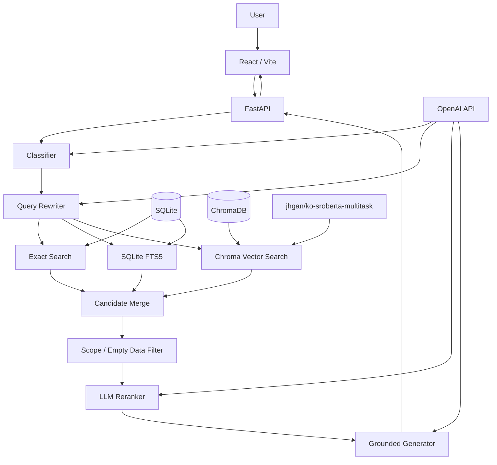

# ⚖️ Law Action Assistant

> 대한민국 법령 데이터를 기반으로 사용자의 법률 질문을 분석하고, 관련 법령을 검색하여 근거 중심의 답변을 제공하는 AI 법률 정보 서비스

**Law Action Assistant**는 단순한 법률 챗봇이 아니라,

**질문 분류 → 검색 질의 생성 → 하이브리드 법령 검색 → Reranking → 근거 기반 답변 생성**

과정을 LangGraph Workflow로 구성한 RAG 기반 AI 서비스입니다.

React와 FastAPI를 분리한 웹서비스 구조로 리팩토링했으며,  
SQLite FTS5와 ChromaDB를 함께 사용하여 키워드 검색과 의미 기반 검색을 결합했습니다.

---

# 🌐 Live Demo

## Frontend

https://law-action-assistant.vercel.app

## Backend API

https://law-action-assistant-production.up.railway.app

## Swagger

https://law-action-assistant-production.up.railway.app/docs

---

# 🚀 Project Overview

법률 질문에서는 단순 Vector Search만으로 정확한 조문을 찾기 어렵습니다.

예를 들어 사용자가 다음과 같이 질문할 수 있습니다.

```text
회사에서 임금을 두 달째 받지 못했습니다.
어떻게 해야 하나요?
```

단순 의미 유사도 검색만 사용하는 경우 임금이라는 단어가 포함된 특수 법률이나 적용 대상이 다른 법령이 함께 검색될 수 있습니다.

Law Action Assistant는 이를 개선하기 위해 여러 검색 방식을 조합합니다.

```text
사용자 질문
    ↓
Classifier
    ↓
Query Rewriter
    ↓
┌──────────────────────────────┐
│ Exact Search                 │
│ SQLite FTS5 / Keyword Search │
│ Chroma Vector Search         │
└──────────────────────────────┘
    ↓
후보 병합
    ↓
Scope / Data Filter
    ↓
LLM Reranker
    ↓
Grounded Generator
    ↓
최종 답변 + 법령 출처
```

---

# 🧠 LangGraph Workflow

현재 AI Pipeline은 다음 5단계로 구성됩니다.

```text
Classifier
    ↓
Query Rewriter
    ↓
Researcher
    ↓
Reranker
    ↓
Generator
```

## 1. Classifier

사용자의 질문이 어떤 법률 분야에 해당하는지 분류합니다.

예:

```text
민사
형사
노동
가사
교통
기타
```

사용 모델:

```text
gpt-5-nano
```

---

## 2. Query Rewriter

사용자의 자연어 질문을 법령 검색에 적합한 형태로 변환합니다.

예:

```text
회사에서 월급을 두 달째 못 받았어요
```

↓

```text
임금
임금 지급
임금체불
근로기준법
```

사용 모델:

```text
gpt-5-nano
```

---

## 3. Researcher

세 가지 방식으로 법령을 검색합니다.

### Exact Search

사용자가 법령명과 조문을 명확하게 입력한 경우 정확하게 검색합니다.

```text
형법 제347조
민법 제839조의2
```

### Keyword / FTS5 Search

SQLite FTS5를 이용해 법령명, 조문명, 본문을 검색합니다.

### Vector Search

`jhgan/ko-sroberta-multitask` 모델로 질문을 Embedding한 뒤  
ChromaDB에서 의미적으로 유사한 법령을 검색합니다.

Vector 검색 결과에는 MMR 방식도 적용하여 검색 결과의 관련성과 다양성을 함께 고려합니다.

---

## 4. Reranker

검색된 후보를 그대로 Generator에 넘기지 않고, 질문과 실제 관련성이 높은 조문을 다시 선별합니다.

사용 모델:

```text
gpt-5-nano
```

다음과 같은 요소를 함께 판단합니다.

- 질문의 핵심 법률관계
- 조문 제목과 질문의 직접적인 연관성
- 일반 규정과 특수 규정 구분
- 미성년자, 선원, 건설근로자 등 적용대상이 다른 법령 제거
- 본문이 없는 조문 제거
- 단순 단어 유사성으로 검색된 잘못된 후보 제거

---

## 5. Generator

Reranker가 최종 선택한 법령을 근거로 사용자에게 답변을 생성합니다.

사용 모델:

```text
gpt-5.6-luna
```

Generator는 검색되지 않은 법령이나 조문을 임의로 생성하지 않도록 제한합니다.

---

# 🏗 System Architecture


```mermaid
flowchart TD

    U[User] --> FE[React / Vite]

    FE --> API[FastAPI]

    API --> C[Classifier]
    C --> QR[Query Rewriter]

    QR --> E[Exact Search]
    QR --> K[SQLite FTS5]
    QR --> V[Chroma Vector Search]

    E --> M[Candidate Merge]
    K --> M
    V --> M

    M --> F[Scope / Empty Data Filter]
    F --> R[LLM Reranker]
    R --> G[Grounded Generator]

    G --> API
    API --> FE

    DB1[(SQLite)] --> E
    DB1 --> K

    DB2[(ChromaDB)] --> V

    EMB[jhgan/ko-sroberta-multitask] --> V
    OAI[OpenAI API] --> C
    OAI --> QR
    OAI --> R
    OAI --> G
```

---

# 📊 Dataset

대한민국 법령 데이터를 수집하여 검색용 데이터베이스로 가공했습니다.

```text
수집 법령 수       : 5,567
원본 조문 수       : 221,399
검색 DB 저장 조문  : 190,277
Vector 수          : 190,277
```

현재 서비스에서 사용하는 핵심 데이터는 다음 두 개입니다.

```text
law_search.db
law_db_optimized/
```

---

# 🗄 SQLite Search DB

```text
law_search.db
```

SQLite에는 다음 정보가 저장됩니다.

```text
법령명
조문 번호
조문 제목
조문 본문
FTS5 검색 데이터
```

담당 기능:

```text
Exact Search
Keyword Search
FTS5 Search
Vector 검색 결과의 실제 법령 본문 조회
```

---

# 🔎 Optimized Vector DB

```text
law_db_optimized/
```

ChromaDB에는 법령 전체 본문을 중복 저장하지 않고 검색에 필요한 ID와 Embedding Vector를 중심으로 저장합니다.

기존 구조:

```text
약 1.9 GB
```

최적화 이후:

```text
약 619 MB
```

기존 Embedding 중 매핑 가능한 Vector는 그대로 재사용했으며,  
누락된 조문만 추가 Embedding했습니다.

```text
재사용 Vector : 189,874
추가 생성      : 403
최종 Vector    : 190,277
```

---

# 🛡 Retrieval Safety

## 적용범위 필터

일반적인 질문에 특정 대상에게만 적용되는 법령이 선택되는 것을 줄입니다.

예:

```text
미성년 근로자
선원
건설 근로자
퇴직 근로자
```

사용자 질문에서 해당 조건이 확인되지 않는 경우 특수 조문을 우선 제외합니다.

## 본문 없는 조문 제외

원본 법령 데이터 일부에서 조문 제목은 존재하지만 실제 본문이 비어 있는 경우가 확인되었습니다.

현재 서비스에서는 이런 조문을 법적 근거로 사용하는 것보다 제외하는 방향으로 처리합니다.

```text
[본문 없음 제외]
```

---

# 🛠 Tech Stack

| Category           | Technology                    |
| ------------------ | ----------------------------- |
| Frontend           | React, Vite, JavaScript       |
| Backend            | FastAPI, Uvicorn              |
| AI Workflow        | LangGraph                     |
| Lightweight LLM    | OpenAI `gpt-5-nano`           |
| Answer LLM         | OpenAI `gpt-5.6-luna`         |
| Embedding          | `jhgan/ko-sroberta-multitask` |
| Vector DB          | ChromaDB                      |
| Search DB          | SQLite, FTS5                  |
| AI Framework       | LangChain                     |
| Backend Deploy     | Railway                       |
| Frontend Deploy    | Vercel                        |
| Persistent Storage | Railway Volume                |
| Python             | Python 3.11                   |

---

# 📁 Project Structure

```text
Law-Action-Assistant/
│
├── backend/
│   ├── graph/
│   │   └── legal_graph.py
│   │
│   ├── schemas/
│   │   └── chat.py
│   │
│   ├── services/
│   │   └── rag_service.py
│   │
│   └── main.py
│
├── frontend/
│   ├── src/
│   ├── package.json
│   └── vite.config.js
│
├── scripts/
│
├── law_search.db
├── law_db_optimized/
│
├── requirements.txt
├── README.md
└── .gitignore
```

`law_search.db`, `law_db_optimized` 등의 대용량 데이터는 GitHub 저장소에 포함하지 않습니다.

---

# 💻 Local Development

현재 개발 환경은 Windows 기준입니다.

## 1. 프로젝트 Clone

```powershell
git clone https://github.com/Lee-TaeGeon/Law-Action-Assistant.git

cd Law-Action-Assistant
```

---

## 2. Python Virtual Environment

Python 3.11 사용을 권장합니다.

```powershell
py -3.11 -m venv .venv
```

PowerShell:

```powershell
.\.venv\Scripts\Activate.ps1
```

패키지 설치:

```powershell
pip install -r requirements.txt
```

---

## 3. Backend Environment Variables

프로젝트 루트에 `.env` 파일을 생성합니다.

```env
OPENAI_API_KEY=YOUR_OPENAI_API_KEY
```

API Key는 절대로 GitHub에 Commit하지 않습니다.

---

## 4. Backend 실행

```powershell
uvicorn backend.main:app --reload --host 127.0.0.1 --port 8000
```

Swagger:

```text
http://127.0.0.1:8000/docs
```

Health Check:

```text
http://127.0.0.1:8000/health
```

---

# 🖥 Frontend 실행

```powershell
cd frontend

npm install
```

`frontend/.env`:

```env
VITE_API_BASE_URL=http://127.0.0.1:8000
```

실행:

```powershell
npm run dev
```

기본 주소:

```text
http://localhost:5173
```

---

# 🔌 API

## POST `/api/chat`

Request:

```json
{
  "question": "회사에서 임금을 두 달째 받지 못했습니다. 어떻게 해야 하나요?",
  "session_id": "default"
}
```

Response:

```json
{
  "category": "노동",
  "answer": "...",
  "sources": [
    {
      "law_name": "근로기준법",
      "article": "제43조",
      "content": "..."
    }
  ]
}
```

---

# ☁️ Deployment Architecture

```text
GitHub
   │
   ├───────────────┐
   │               │
   ▼               ▼
Railway          Vercel
Backend          Frontend
   │
   ▼
Railway Volume
   │
   ├── law_search.db
   └── law_db_optimized/
```

---

# 🚂 Railway Backend Deployment

## 1. GitHub Push

로컬 수정이 끝났다면:

```powershell
git status

git add .

git commit -m "수정 내용"

git push origin main
```

Railway가 GitHub Repository의 `main` 브랜치와 연결되어 있다면 Push 이후 자동으로 새 Deployment가 시작됩니다.

---

## 2. Railway Start Command

Railway 서비스의 Start Command:

```bash
uvicorn backend.main:app --host 0.0.0.0 --port $PORT
```

---

## 3. Railway Environment Variables

Railway → Service → Variables에서 다음 값을 설정합니다.

```env
OPENAI_API_KEY=YOUR_OPENAI_API_KEY

LAW_DATA_DIR=/data

CORS_ORIGINS=https://law-action-assistant.vercel.app

RAILPACK_PYTHON_VERSION=3.11
```

API Key는 Repository에 저장하지 않습니다.

---

# 💾 Railway Persistent Volume

법령 DB는 GitHub에 올리지 않고 Railway Volume에 별도로 저장합니다.

Mount Path:

```text
/data
```

최종 구조:

```text
/data/
├── law_search.db
└── law_db_optimized/
```

Backend에서는 다음 환경변수를 사용합니다.

```env
LAW_DATA_DIR=/data
```

로컬에서는 환경변수가 없으면 프로젝트 루트의 DB를 사용합니다.

---

# 🧰 Railway CLI

Windows에서 Railway CLI 설치:

```powershell
npm install -g @railway/cli
```

확인:

```powershell
railway --version
```

로그인:

```powershell
railway login
```

프로젝트 연결:

```powershell
railway link
```

상태 확인:

```powershell
railway status
```

---

# 📦 Railway DB Upload

대용량 DB는 GitHub가 아닌 Railway Volume으로 직접 업로드합니다.

## SQLite

```powershell
railway service files upload `
  .\law_search.db `
  /data/law_search.db
```

## Vector DB

```powershell
railway service files upload `
  .\law_db_optimized `
  /data/law_db_optimized
```

파일 확인:

```powershell
railway service files list /data
```

---

# ✅ SQLite Upload Verification

대용량 SQLite 파일은 업로드 후 파일 크기와 무결성을 확인하는 것이 좋습니다.

Railway 서버 내부:

```powershell
railway ssh -- python -c "import os,sqlite3; p='/data/law_search.db'; print('size:',os.path.getsize(p)); db=sqlite3.connect(p); print('integrity:',db.execute('PRAGMA integrity_check').fetchone()); db.close()"
```

정상:

```text
integrity: ('ok',)
```

SHA256도 비교할 수 있습니다.

로컬:

```powershell
Get-FileHash .\law_search.db -Algorithm SHA256
```

Railway:

```powershell
railway ssh -- sha256sum /data/law_search.db
```

두 Hash가 동일하면 업로드된 데이터가 원본과 동일합니다.

---

# ▲ Vercel Frontend Deployment

Vercel에서 GitHub Repository를 연결합니다.

설정:

```text
Framework Preset
Vite

Root Directory
frontend

Build Command
npm run build

Output Directory
dist
```

Environment Variable:

```env
VITE_API_BASE_URL=https://law-action-assistant-production.up.railway.app
```

배포 후 Frontend URL:

```text
https://law-action-assistant.vercel.app
```

---

# 🌐 CORS

FastAPI에서는 로컬과 Vercel Origin을 허용합니다.

로컬:

```text
http://localhost:5173
```

배포 환경은 Railway 환경변수에서 설정합니다.

```env
CORS_ORIGINS=https://law-action-assistant.vercel.app
```

---

# 🔄 코드 수정 후 재배포

평소 개발 이후에는 다음 과정만 수행하면 됩니다.

```text
코드 수정
    ↓
Local Test
    ↓
git add
    ↓
git commit
    ↓
git push origin main
    ↓
GitHub
    ↓
┌──────────────────┐
│ Railway Redeploy │
│ Vercel Redeploy  │
└──────────────────┘
    ↓
Production Test
```

실제 명령:

```powershell
git status

git add .

git commit -m "개선: 변경 내용"

git push origin main
```

Backend 파일 변경 시 Railway가 자동 재배포되고,  
Frontend 파일 변경 시 Vercel도 자동 재배포됩니다.

---

# 🔍 Deployment Test

## Backend

```text
https://law-action-assistant-production.up.railway.app
```

Health:

```text
https://law-action-assistant-production.up.railway.app/health
```

Swagger:

```text
https://law-action-assistant-production.up.railway.app/docs
```

## Frontend

```text
https://law-action-assistant.vercel.app
```

실제 서비스에서 질문을 입력하여 다음 전체 흐름을 확인합니다.

```text
React
↓
Railway FastAPI
↓
LangGraph
↓
SQLite / ChromaDB
↓
OpenAI
↓
Answer + Sources
```

---

# 🔧 Deployment Troubleshooting

## HTTP 500

먼저 Railway Deploy Logs를 확인합니다.

OpenAI 연결 테스트:

```powershell
railway ssh -- python -c "import os; print(bool(os.getenv('OPENAI_API_KEY')))"
```

`True`가 나와야 합니다.

직접 모델 호출 테스트:

```powershell
railway ssh -- python -c "from backend.graph.legal_graph import get_fast_llm; print(get_fast_llm().invoke('테스트라고 답해').content)"
```

---

## SQLite DB 오류

다음과 같은 오류가 발생할 수 있습니다.

```text
database disk image is malformed
```

이 경우 Railway에 업로드된 DB가 완전한지 파일 크기, SHA256, `PRAGMA integrity_check`를 확인합니다.

검증된 새 DB를 임시 파일로 업로드한 뒤 정상임을 확인하고 교체하는 방식이 안전합니다.

---

## CORS 오류

Frontend에서는 정상인데 API 호출이 차단된다면 Railway의:

```env
CORS_ORIGINS
```

값을 확인합니다.

현재 Production Origin:

```text
https://law-action-assistant.vercel.app
```

---

# 🔐 Security

다음 파일과 값은 GitHub에 업로드하지 않습니다.

```text
.env
OPENAI_API_KEY
.venv/
frontend/node_modules/
law_search.db
law_db_optimized/
```

대용량 데이터는 Railway Volume 또는 별도 Backup Storage에서 관리합니다.

---

# 📌 Current Limitations

현재 서비스는 포트폴리오 및 기술 검증을 위한 Beta 버전입니다.

수집된 일부 법령 데이터에서 본문이 비어 있는 조문이 확인되었습니다.

따라서 현재는 본문이 없는 조문을 답변의 법적 근거에서 제외합니다.

향후 개선 계획:

- 국가법령정보 공동활용 API 기반 데이터 재수집
- 법령 자동 최신화
- 법령 개정 이력 관리
- Retrieval Evaluation Dataset 구축
- Recall / Precision 평가
- 법령 원문 링크 제공
- 사용자 인증
- 상담 기록 서버 저장
- 검색 및 LLM 비용 최적화

---

# ⚠️ Disclaimer

Law Action Assistant는 변호사 등 법률 전문가의 자문을 대체하지 않습니다.

본 서비스가 제공하는 답변은 검색된 대한민국 법령 데이터를 기반으로 생성되는 참고용 법률 정보이며, 구체적인 사건에 대한 법률 판단이나 법률 자문을 의미하지 않습니다.

실제 법적 대응이 필요한 경우 법률 전문가의 검토가 필요할 수 있습니다.

---

# 👨‍💻 Developer

**이태건**

AI Service / Backend Developer

GitHub:

https://github.com/Lee-TaeGeon

---

# 📄 License

본 프로젝트는 포트폴리오 및 학습 목적으로 개발되었습니다.
