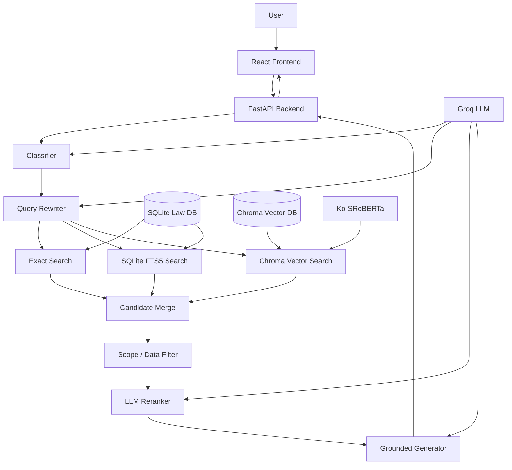

# ⚖️ Law Action Assistant

> **대한민국 법령 데이터를 기반으로 사용자의 법률 질문을 분석하고, 관련 법령을 검색해 근거 중심의 답변을 생성하는 AI 법률 정보 서비스**

Law Action Assistant는 단순한 법률 챗봇이 아니라  
**질문 분류 → 검색 질의 확장 → 하이브리드 법령 검색 → Reranking → 답변 생성** 과정을 LangGraph로 구성한 RAG 기반 AI 서비스입니다.

React와 FastAPI를 기반으로 프론트엔드와 백엔드를 분리했으며,  
SQLite FTS5와 ChromaDB를 결합해 정확한 키워드 검색과 의미 기반 검색을 함께 수행합니다.

---

## 🌐 Live Demo

### Frontend

https://law-action-assistant.vercel.app

### Backend API

https://law-action-assistant-production.up.railway.app

### Swagger API Docs

https://law-action-assistant-production.up.railway.app/docs

---

# 🚀 Project Overview

법률 질문에서는 단순한 의미 유사도 검색만으로 정확한 조문을 찾기 어려운 경우가 많습니다.

예를 들어 사용자가

> "회사에서 두 달째 임금을 받지 못했습니다. 어떻게 해야 하나요?"

라고 질문했을 때 단순 Vector Search만 수행하면  
임금과 관련된 여러 특수 법령이나 행정 규정이 함께 검색될 수 있습니다.

Law Action Assistant는 이를 개선하기 위해 다음 검색 방식을 결합합니다.

```text
사용자 질문
    ↓
Classifier
    ↓
Query Rewriter
    ↓
┌───────────────────────────────┐
│ Exact Search                  │
│ SQLite Keyword / FTS5 Search  │
│ Vector Search                 │
└───────────────────────────────┘
    ↓
후보 병합 및 중복 제거
    ↓
적용대상 / 불완전 데이터 필터
    ↓
LLM Reranker
    ↓
Grounded Answer Generator
    ↓
최종 답변 + 법령 출처
```

---

# ✨ Key Features

## 1. LangGraph 기반 법률 AI Workflow

전체 AI 처리 과정을 LangGraph 노드로 분리했습니다.

```text
Classifier
    ↓
Query Rewriter
    ↓
Researcher
    ↓
Reranker
    ↓
Generator
```

각 단계가 하나의 역할만 담당하도록 구성하여  
검색 로직과 생성 로직을 분리했습니다.

---

## 2. Hybrid Legal Retrieval

하나의 검색 방식에 의존하지 않고 세 가지 검색을 함께 수행합니다.

### Exact Search

사용자가 법령명과 조문을 직접 입력한 경우 해당 조문을 정확하게 검색합니다.

예:

```text
형법 제347조
민법 제839조의2
```

### Keyword Search

SQLite + FTS5를 사용해 법령명, 조문명, 본문에 등장하는 법률 용어를 검색합니다.

예:

```text
재산분할
임금 지급
사기
고소권자
```

### Vector Search

`jhgan/ko-sroberta-multitask` 임베딩 모델을 이용해  
질문과 의미적으로 유사한 조문을 ChromaDB에서 검색합니다.

검색 결과는 MMR(Maximal Marginal Relevance)을 이용해  
관련성과 다양성을 함께 고려합니다.

---

## 3. LLM Reranking

검색된 법령을 그대로 답변에 사용하는 대신  
LLM이 사용자의 실제 질문과 관련성이 높은 조문을 다시 선별합니다.

Reranker는 다음 요소를 고려합니다.

- 질문의 핵심 권리와 의무
- 실체법과 절차법 구분
- 조문 제목과 질문의 직접 관련성
- 특정 직업·신분·상황에만 적용되는 특수 규정
- 행정기관 조직 규정 등 간접적인 후보 제거
- 유사 단어만 포함된 다른 법률관계 제거

예를 들어 일반적인 임금체불 질문에서는  
선원법이나 건설업 전용 규정보다 일반적인 근로기준법 규정을 우선합니다.

---

## 4. Hallucination 방지를 위한 Grounded Generation

Generator는 검색된 법령 범위 안에서만 답변하도록 제한합니다.

주요 규칙:

- 검색되지 않은 법령 또는 조문 번호 생성 금지
- 근거가 없는 기간·금액·절차 임의 생성 금지
- 사용자 질문에 없는 사실을 확정적으로 추가하지 않음
- 법령 적용 범위를 임의로 확대하지 않음
- 법률 근거가 부족한 경우 불확실성을 명시

이를 통해 일반적인 LLM 법률 답변에서 발생할 수 있는  
**법령 번호 Hallucination**을 줄이도록 설계했습니다.

---

# 🧠 System Architecture


```mermaid
flowchart TD

    U[User] --> R[React Frontend]

    R --> API[FastAPI Backend]

    API --> C[Classifier]

    C --> Q[Query Rewriter]

    Q --> S1[Exact Search]
    Q --> S2[SQLite FTS5 Search]
    Q --> S3[Chroma Vector Search]

    S1 --> M[Candidate Merge]
    S2 --> M
    S3 --> M

    M --> F[Scope / Data Filter]

    F --> RR[LLM Reranker]

    RR --> G[Grounded Generator]

    G --> API
    API --> R

    DB1[(SQLite Law DB)] --> S1
    DB1 --> S2

    DB2[(Chroma Vector DB)] --> S3

    EMB[Ko-SRoBERTa] --> S3

    LLM[Groq LLM] --> C
    LLM --> Q
    LLM --> RR
    LLM --> G
```

---

# 📊 Legal Dataset

프로젝트에서는 대한민국 법령 데이터를 수집하여 검색용 데이터베이스로 가공했습니다.

현재 데이터 처리 결과:

```text
수집 법령 수        5,567
원본 조문 수        221,399
검색 DB 저장 조문   190,277
Vector 수           190,277
```

검색 데이터는 두 계층으로 분리했습니다.

### SQLite

```text
law_search.db
```

담당 역할:

- 법령명
- 조문번호
- 조문명
- 조문 본문
- Exact Search
- Keyword Search
- FTS5 검색

### ChromaDB

```text
law_db_optimized/
```

담당 역할:

- Article ID
- Embedding Vector
- Semantic Search

법령 본문과 메타데이터를 Vector DB에 중복 저장하지 않고 SQLite에 분리하여  
기존 Vector DB 크기를 약 **1.9GB → 약 619MB**로 줄였습니다.

---

# 🔎 Vector DB Optimization

기존 ChromaDB에는 다음 데이터가 함께 저장되어 있었습니다.

```text
Embedding
Metadata
Document
Full Text Search Data
```

이 때문에 DB 크기가 약 1.9GB까지 증가했습니다.

리팩토링 후에는 ChromaDB가 다음 데이터만 담당합니다.

```text
article_id
embedding
```

실제 법령 본문과 조문 정보는 SQLite에서 조회합니다.

결과:

```text
기존 Vector DB
약 1.9 GB

↓

Optimized Vector DB
약 619 MB
```

기존 Embedding 189,874개는 그대로 재사용하고  
매핑되지 않은 403개 조문만 새로 Embedding하여 전체 재계산 비용도 줄였습니다.

---

# 🛡 Retrieval Safety

법령 검색 과정에는 추가적인 안전 필터를 적용했습니다.

### Scope Mismatch Filtering

특정 상황에서만 적용되는 조문이 일반 질문에 포함되는 것을 방지합니다.

예:

```text
미성년 근로자
선원
건설업 근로자
퇴직 근로자
```

사용자 질문에 해당 조건이 없는 경우 관련 특수 조문을 우선적으로 제외합니다.

### Empty Article Filtering

원본 데이터에서 실제 법문이 누락되고 조문 제목만 존재하는 경우가 확인되어  
본문이 없는 조문은 Reranker의 법적 근거에서 제외합니다.

```text
[본문 없음 제외]
```

현재 버전에서는 잘못된 근거를 사용하는 것보다  
근거가 부족한 조문을 제외하는 방향으로 동작합니다.

---

# 🖥 Frontend

기존 Streamlit UI를 제거하고 React 기반 인터페이스로 리팩토링했습니다.

주요 기능:

- AI 법률 상담 Chat UI
- Markdown 답변 렌더링
- 관련 법령 Source Card
- 대화 기록 저장
- Sidebar 대화 목록
- LocalStorage 기반 세션 관리
- 모바일 Responsive UI
- FastAPI REST API 연동

Frontend는 Vercel에 배포했습니다.

---

# ⚙️ Backend

FastAPI를 중심으로 AI/RAG 로직을 API 서버로 분리했습니다.

주요 API:

```http
GET /
```

서비스 상태 확인

```http
GET /health
```

Health Check

```http
POST /api/chat
```

법률 AI 상담

예:

```json
{
  "question": "회사에서 임금을 두 달째 받지 못했습니다. 어떻게 해야 하나요?",
  "session_id": "default"
}
```

---

# 🛠 Tech Stack

| Category | Technology |
|---|---|
| Frontend | React, Vite, JavaScript |
| Backend | FastAPI, Uvicorn |
| AI Workflow | LangGraph |
| LLM | Groq / `openai/gpt-oss-120b` |
| Embedding | `jhgan/ko-sroberta-multitask` |
| Vector DB | ChromaDB |
| Search DB | SQLite, FTS5 |
| AI Library | LangChain, LangChain HuggingFace |
| Frontend Deploy | Vercel |
| Backend Deploy | Railway |
| Persistent Storage | Railway Volume |
| Language | Python 3.11 |

---

# 📁 Project Structure

```text
Law-Action-Assistant/
│
├── backend/
│   ├── graph/
│   │   └── legal_graph.py
│   │
│   ├── schemas/
│   │   └── chat.py
│   │
│   ├── services/
│   │   └── rag_service.py
│   │
│   └── main.py
│
├── frontend/
│   ├── src/
│   ├── package.json
│   └── vite.config.js
│
├── scripts/
│   ├── build_law_search_db.py
│   ├── audit_vector_mapping.py
│   ├── build_optimized_vector_db.py
│   └── compare_vector_search.py
│
├── requirements.txt
├── README.md
└── .gitignore
```

대용량 법령 DB는 Git 저장소에 포함하지 않습니다.

---

# 💻 Local Development

## Backend

Python 3.11 환경을 권장합니다.

```bash
python -m venv .venv
source .venv/bin/activate
```

패키지 설치:

```bash
pip install -r requirements.txt
```

환경변수:

```env
GROQ_API_KEY=YOUR_GROQ_API_KEY
```

FastAPI 실행:

```bash
uvicorn backend.main:app \
  --reload \
  --host 0.0.0.0 \
  --port 8000
```

Swagger:

```text
http://localhost:8000/docs
```

---

## Frontend

```bash
cd frontend
npm install
npm run dev
```

개발 서버:

```text
http://localhost:5173
```

`.env`:

```env
VITE_API_BASE_URL=http://localhost:8000
```

---

# ☁️ Deployment

## Frontend

Vercel

```text
https://law-action-assistant.vercel.app
```

## Backend

Railway

```text
https://law-action-assistant-production.up.railway.app
```

Railway Start Command:

```bash
uvicorn backend.main:app --host 0.0.0.0 --port $PORT
```

Railway Environment Variables:

```env
GROQ_API_KEY=...
LAW_DATA_DIR=/data
CORS_ORIGINS=https://law-action-assistant.vercel.app
```

법령 데이터는 Railway Persistent Volume의 `/data`에 저장합니다.

```text
/data/
├── law_search.db
└── law_db_optimized/
```

---

# 🧪 Example Retrieval

사용자 질문:

```text
이혼할 때 재산분할을 어떻게 청구할 수 있나요?
```

검색 Pipeline:

```text
Query Rewrite
↓
재산분할
재산분할청구권
부부재산
가사소송
가사조정

↓

Keyword Search
+ Vector Search

↓

Reranker

↓

민법 제839조의2 재산분할청구권
가사소송규칙 제98조 부부재산의 분할
```

또 다른 예:

```text
회사에서 임금을 두 달째 받지 못했습니다.
어떻게 해야 하나요?
```

핵심 검색 결과:

```text
근로기준법 제43조 임금 지급
임금채권보장법 관련 조문
```

검색된 법령만 최종 Generator에 전달됩니다.

---

# 🔄 Refactoring

초기 버전:

```text
Streamlit
+
LangChain
+
ChromaDB
+
Groq
```

현재 버전:

```text
React
        ↓
FastAPI
        ↓
LangGraph
        ↓
Hybrid Retrieval
 ├ Exact Search
 ├ SQLite FTS5
 └ Chroma Vector Search
        ↓
Reranker
        ↓
Grounded Generator
```

단순 프로토타입에서 실제 웹서비스 형태로 구조를 리팩토링했습니다.

---

# 📌 Current Limitations

현재 버전은 포트폴리오 및 기술 검증을 위한 Beta 버전입니다.

일부 수집 법령에서 본문이 누락된 데이터가 존재하기 때문에  
실제 법문이 없는 조문은 답변 근거에서 제외하도록 처리하고 있습니다.

향후 다음 작업을 진행할 예정입니다.

- 국가법령정보 공동활용 API 기반 법령 데이터 재구축
- 법령 최신화 자동화
- 법령 개정 이력 관리
- 검색 평가 Dataset 구축
- Retrieval Recall / Precision 평가
- Vector Index 추가 경량화
- 법령 Source Link 제공
- 사용자 인증 및 상담 기록 서버 저장

---

# ⚠️ Disclaimer

Law Action Assistant는 법률 전문가의 자문을 대체하지 않습니다.

서비스에서 제공되는 내용은 검색된 대한민국 법령 데이터를 기반으로 생성되는  
**참고용 법률 정보**이며 실제 사건에 대한 법적 판단이나 법률 자문을 의미하지 않습니다.

구체적인 법률 문제에 대해서는 변호사 등 법률 전문가의 검토가 필요할 수 있습니다.

---

# 👨‍💻 Developer

**이태건**

AI Service / Backend Developer

GitHub:  
https://github.com/Lee-TaeGeon

---

## 📄 License

본 프로젝트는 포트폴리오 및 학습 목적으로 개발되었습니다.