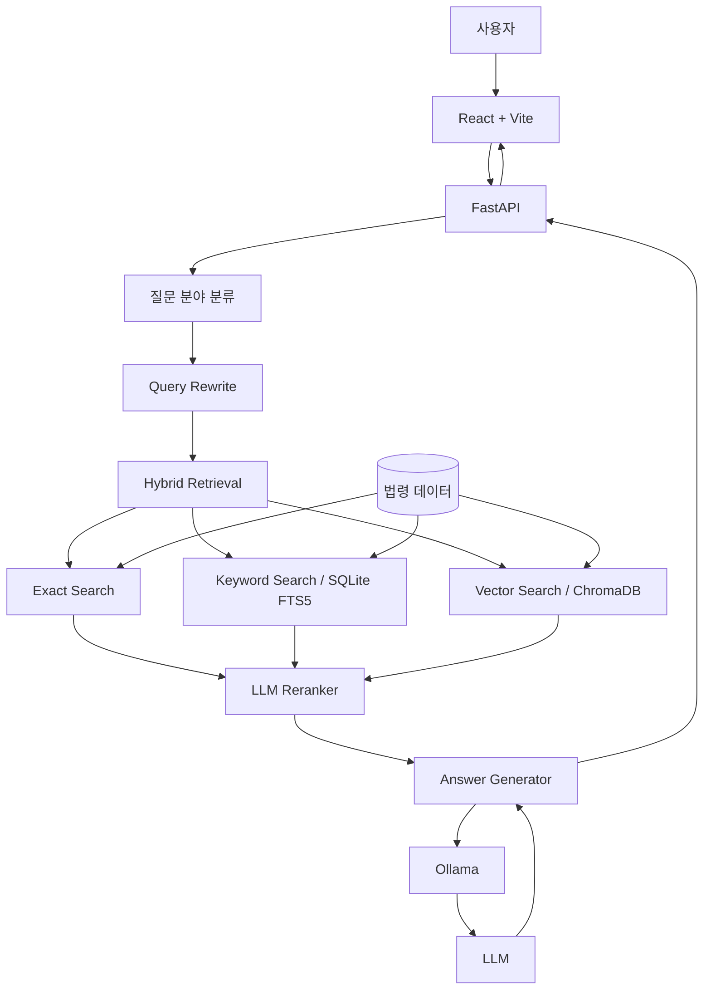

# ⚖️ Law Action Assistant

대한민국 법령 데이터를 기반으로 사용자의 법률 질문을 분석하고,  
관련 법령을 검색하여 근거와 함께 답변을 제공하는 **RAG 기반 법률 AI Agent**입니다.

단순한 LLM 질의응답이 아니라,

**질문 분류 → 검색 질의 재작성 → Hybrid Retrieval → LLM Reranking → 근거 기반 답변 생성**

과정을 LangGraph로 구성했습니다.

개발 환경에서는 **Ollama Local**, 배포 환경에서는 **Ollama Cloud**를 사용하여  
OpenAI API에 의존하지 않고 Local / Cloud LLM 환경을 분리했습니다.

> ⚠️ 본 프로젝트는 법률 정보 검색 및 AI 기술 데모를 목적으로 제작되었습니다.  
> 제공되는 답변은 법률 자문을 대체하지 않으며 실제 사건에 대한 법적 판단은 달라질 수 있습니다.

---

## 🌐 Architecture


```mermaid
flowchart TD

    U[사용자]
    F[React + Vite]
    B[FastAPI]
    C[질문 분야 분류]
    Q[Query Rewrite]
    R[Hybrid Retrieval]
    E[Exact Search]
    K[Keyword Search / SQLite FTS5]
    V[Vector Search / ChromaDB]
    RR[LLM Reranker]
    G[Answer Generator]
    O[Ollama]
    M[LLM]
    D[(법령 데이터)]

    U --> F
    F --> B
    B --> C
    C --> Q
    Q --> R

    R --> E
    R --> K
    R --> V

    D --> E
    D --> K
    D --> V

    E --> RR
    K --> RR
    V --> RR

    RR --> G
    G --> O
    O --> M
    M --> G
    G --> B
    B --> F
```

### 개발 환경

```text
React
  ↓
FastAPI
  ↓
LangGraph
  ↓
Hybrid RAG
  ↓
Ollama Local
  ↓
qwen3:8b
  ↓
Local GPU
```

### 배포 환경

```text
Vercel
  ↓
Railway
  ↓
FastAPI
  ↓
LangGraph + RAG
  ↓
Ollama Cloud
  ↓
gpt-oss:20b
```

배포 환경에서는 로컬 PC가 꺼져 있어도  
Railway Backend와 Ollama Cloud를 통해 AI 응답을 생성할 수 있습니다.

---

# ✨ 주요 기능

## 1. 법률 질문 분야 자동 분류

사용자의 질문을 다음 분야 중 하나로 분류합니다.

- 민사
- 형사
- 가사
- 노동
- 행정
- 기타

예시:

```text
돈을 보냈는데 판매자가 물건을 보내지 않고 연락을 끊었습니다.
```

→ `형사`

분류 결과는 이후 법령 검색 범위를 조정하는 데 활용됩니다.

---

## 2. Query Rewrite

사용자의 자연어 질문을 법령 검색에 적합한 핵심 법률 표현으로 변환합니다.

예:

```text
월급을 받지 못했습니다.
```

↓

```text
임금
임금 지급
임금체불
체불임금
```

LLM이 임의로 조문 번호를 생성하지 않도록 제한하고,  
실체적인 권리·의무·책임에 해당하는 법률 용어를 우선 생성합니다.

---

## 3. Hybrid Retrieval

한 가지 검색 방식에 의존하지 않고 여러 검색 결과를 결합합니다.

### Exact Search

사용자가 직접 입력한 법령명이나 조문을 검색합니다.

### Keyword Search

SQLite FTS5 기반으로 법령 본문과 조문명을 검색합니다.

### Vector Search

ChromaDB와 Sentence Transformer Embedding을 이용하여  
의미적으로 관련된 법령을 검색합니다.

```text
Exact Search
      +
Keyword Search
      +
Vector Search
      ↓
Candidate Laws
```

중복되는 법령/조문은 제거한 뒤 Reranker로 전달합니다.

---

## 4. LLM Reranking

검색 결과에 단순히 동일한 단어가 등장한다고 해서  
관련 법령으로 사용하지 않습니다.

LLM Reranker가 다음 항목을 고려하여 법령 후보를 다시 평가합니다.

- 사용자의 실제 질문과 직접 관련된 법령인지
- 실체적인 권리·의무를 규정하는 조문인지
- 특정 직업·신분·상황에만 적용되는 조문인지
- 조문 제목뿐 아니라 실제 본문도 관련성이 있는지
- 행정 조직이나 특수 절차만 규정한 조문인지

최대 4개의 핵심 법령만 최종 Context로 전달합니다.

---

## 5. 근거 기반 답변 생성

최종 Generator는 RAG에서 검색된 법령만을 근거로 답변합니다.

LLM이 알고 있는 일반적인 법률 지식을 임의로 추가하지 않도록 제한했습니다.

답변 형식:

```text
상황 분석

대응 방법
1. ...
2. ...

주의사항

관련 법령
- 법령명 / 조문
```

검색되지 않은 다음 내용은 임의로 생성하지 않도록 Prompt를 구성했습니다.

- 법령명
- 조문 번호
- 기관명
- 제출 서류
- 처리 기간
- 금액
- 시효
- 신고 방법
- 소송 절차

---

# 🤖 Ollama 기반 LLM

기존 Cloud LLM API 의존 구조에서 벗어나  
Ollama 기반 Local / Cloud LLM 구조를 적용했습니다.

## Local Development

개발 환경에서는 로컬 Ollama를 사용합니다.

```env
OLLAMA_BASE_URL=http://localhost:11434
OLLAMA_FAST_MODEL=qwen3:8b
OLLAMA_ANSWER_MODEL=qwen3:8b
```

구조:

```text
FastAPI
  ↓
LangGraph
  ↓
ChatOllama
  ↓
localhost:11434
  ↓
qwen3:8b
```

별도의 외부 LLM API 호출 없이 로컬 GPU를 이용하여 추론할 수 있습니다.

---

## Ollama Cloud

배포 환경에서는 Ollama Cloud를 사용합니다.

```env
OLLAMA_BASE_URL=https://ollama.com
OLLAMA_API_KEY=YOUR_OLLAMA_API_KEY
OLLAMA_FAST_MODEL=gpt-oss:20b
OLLAMA_ANSWER_MODEL=gpt-oss:20b
```

구조:

```text
Railway
  ↓
FastAPI
  ↓
LangGraph
  ↓
Ollama Cloud API
  ↓
gpt-oss:20b
```

API Key가 존재할 경우 Bearer Authentication Header를 자동으로 추가하도록 구현했습니다.

따라서 동일한 코드에서 환경변수만 변경하여

```text
Local Ollama ↔ Ollama Cloud
```

환경을 전환할 수 있습니다.

---

# 🧠 Agent Workflow

전체 LangGraph Workflow는 다음과 같습니다.

```text
START
  ↓
Classifier
  ↓
Query Rewriter
  ↓
Researcher
  ↓
Reranker
  ↓
Generator
  ↓
END
```

### Classifier

질문의 법률 분야를 판별합니다.

### Query Rewriter

자연어 질문을 법령 검색용 Query로 변환합니다.

### Researcher

Exact + Keyword + Vector Search를 수행합니다.

### Reranker

검색된 후보 중 질문과 직접 관련된 법령을 선택합니다.

### Generator

선택된 법령만을 기반으로 최종 답변을 작성합니다.

---

# 🛠 Tech Stack

## Frontend

- React
- Vite
- JavaScript
- CSS

## Backend

- Python
- FastAPI
- Uvicorn

## AI / Agent

- LangChain
- LangGraph
- Ollama
- Ollama Cloud
- Qwen3
- gpt-oss

## RAG / Search

- ChromaDB
- SQLite
- FTS5
- Sentence Transformers
- HuggingFace Embedding

## Deployment

- Vercel — Frontend
- Railway — Backend
- Ollama Cloud — LLM Inference

---

# 📁 Project Structure

```text
Law-Action-Assistant
│
├── backend
│   ├── graph
│   │   └── legal_graph.py
│   │
│   ├── services
│   │   └── rag_service.py
│   │
│   ├── schemas
│   └── main.py
│
├── frontend
│   ├── public
│   ├── src
│   ├── package.json
│   └── vite.config.js
│
├── law_db
├── law_db_optimized
│
├── scripts
│
├── requirements.txt
├── .gitignore
└── README.md
```

---

# 🚀 Local Setup

## 1. Repository Clone

```bash
git clone https://github.com/Lee-TaeGeon/Law-Action-Assistant.git
cd Law-Action-Assistant
```

---

## 2. Python Virtual Environment

### Windows

```powershell
python -m venv .venv
.\.venv\Scripts\Activate.ps1
```

---

## 3. Install Backend Dependencies

```powershell
python -m pip install -r requirements.txt
```

---

## 4. Install Ollama

Ollama 설치 후 사용할 모델을 다운로드합니다.

```powershell
ollama run qwen3:8b
```

설치 확인:

```powershell
ollama list
```

---

## 5. Environment Variables

프로젝트 루트에 `.env`를 생성합니다.

```env
OLLAMA_BASE_URL=http://localhost:11434
OLLAMA_FAST_MODEL=qwen3:8b
OLLAMA_ANSWER_MODEL=qwen3:8b
```

> `.env` 파일은 Git에 Commit하지 않습니다.

---

## 6. Run Backend

```powershell
python -m uvicorn backend.main:app --reload --port 8000
```

Backend:

```text
http://localhost:8000
```

FastAPI Docs:

```text
http://localhost:8000/docs
```

---

## 7. Run Frontend

새 터미널에서:

```powershell
cd frontend
npm install
npm run dev
```

Frontend:

```text
http://localhost:5173
```

---

# ☁️ Deployment

## Frontend

Frontend는 Vercel을 사용합니다.

```text
React / Vite
     ↓
Vercel
```

---

## Backend

Backend는 Railway를 사용합니다.

```text
FastAPI
   ↓
Railway
```

Railway Start Command 예시:

```bash
uvicorn backend.main:app --host 0.0.0.0 --port $PORT
```

---

## Railway Environment Variables

```env
OLLAMA_BASE_URL=https://ollama.com
OLLAMA_API_KEY=YOUR_OLLAMA_API_KEY
OLLAMA_FAST_MODEL=gpt-oss:20b
OLLAMA_ANSWER_MODEL=gpt-oss:20b
```

API Key는 Repository에 저장하지 않고  
Railway Variables에서 관리합니다.

---

# 🔐 Security

다음 값은 GitHub Repository에 Commit하지 않습니다.

```text
.env
OLLAMA_API_KEY
API Keys
Secret Keys
```

`.gitignore`를 통해 환경설정 파일과 가상환경을 제외합니다.

---

# 📌 Example

### 사용자

```text
월급을 받지 못했는데 어떻게 해야 하나요?
```

### Agent

```text
1. 질문을 노동 분야로 분류

2. 검색 Query 생성
   - 임금
   - 임금 지급
   - 임금체불
   - 체불임금

3. 법령 검색
   - Exact Search
   - Keyword Search
   - Vector Search

4. Reranking

5. 관련 법령 기반 답변 생성
```

---

# 🎯 프로젝트에서 구현한 핵심 내용

- LangGraph 기반 Multi-step Legal Agent 설계
- 법률 질문 자동 분류
- LLM 기반 Query Rewrite
- SQLite FTS5 기반 Keyword Retrieval
- ChromaDB 기반 Vector Retrieval
- Exact + Keyword + Vector Hybrid Retrieval
- LLM Reranking
- RAG Grounded Answer Generation
- Local Ollama 연동
- Ollama Cloud 연동
- Local / Cloud LLM 실행환경 분리
- FastAPI Backend API 구축
- React 기반 Web UI
- Vercel / Railway Cloud Deployment

---

# 🔄 Local / Cloud LLM Architecture

이 프로젝트의 특징 중 하나는 동일한 Agent 코드에서  
LLM 실행 환경을 변경할 수 있다는 점입니다.

```text
                LangGraph
                    │
                 ChatOllama
                /          \
               /            \
      Local Development     Production
             │                  │
        Ollama Local        Ollama Cloud
             │                  │
          qwen3:8b          gpt-oss:20b
             │                  │
        Local GPU           Cloud GPU
```

개발 단계에서는 Local GPU를 사용하여 API 비용 없이 테스트하고,  
배포 환경에서는 Cloud inference를 사용하여 로컬 PC와 독립적으로 서비스할 수 있습니다.

---

# ⚠️ Limitations

현재 프로젝트는 다음과 같은 한계가 있습니다.

- 검색된 법령의 관련성이 질문에 따라 달라질 수 있습니다.
- LLM Reranker가 관련성이 낮은 법령을 선택할 가능성이 있습니다.
- 법령 데이터의 최신성이 실제 현행 법령과 다를 수 있습니다.
- 판례 검색은 현재 핵심 기능에 포함되어 있지 않습니다.
- AI의 답변은 실제 법률 자문을 대신할 수 없습니다.

따라서 실제 법률 문제에 적용하기 전 반드시 최신 법령과 공식 자료를 확인해야 합니다.

---

# 🗺 Roadmap

향후 개선 예정 기능:

- [ ] RAG 검색 정확도 개선
- [ ] 법률 분야별 Retrieval Filtering 강화
- [ ] Reranker 평가 로직 개선
- [ ] 관련성이 낮은 법령 자동 제거
- [ ] 판례 검색 기능 추가
- [ ] 답변 근거 검증 단계 추가
- [ ] 법령 데이터 최신화 자동화
- [ ] LLM 모델별 응답 품질 비교
- [ ] Streaming Response 지원
- [ ] 테스트 및 Evaluation Dataset 구축

---

# 👨‍💻 Developer

**이태건**

AI Service / Backend Developer

GitHub  
https://github.com/Lee-TaeGeon

---

## License

본 프로젝트는 포트폴리오 및 학습 목적으로 개발되었습니다.
